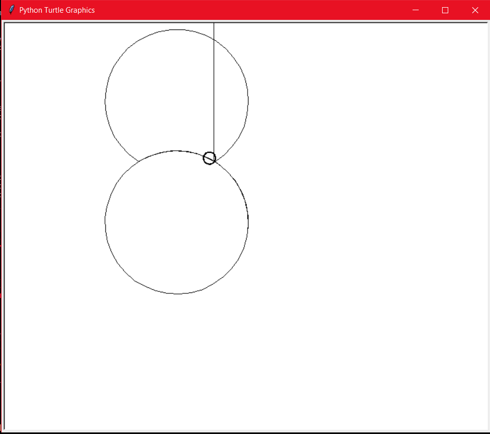
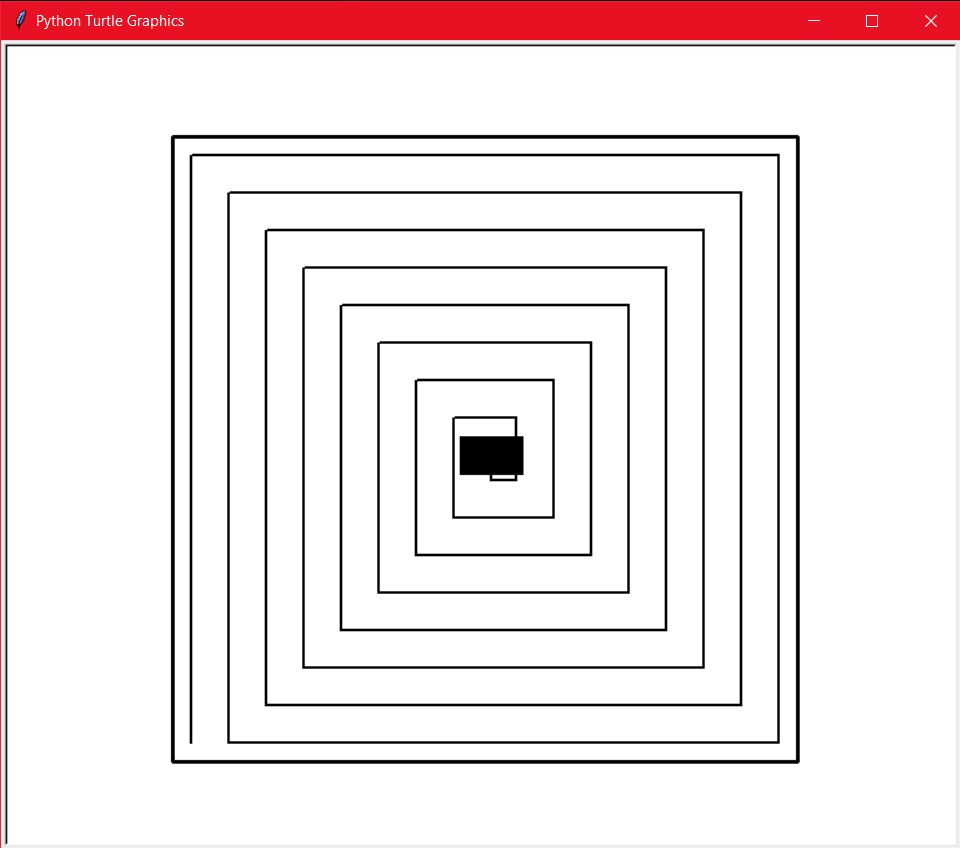
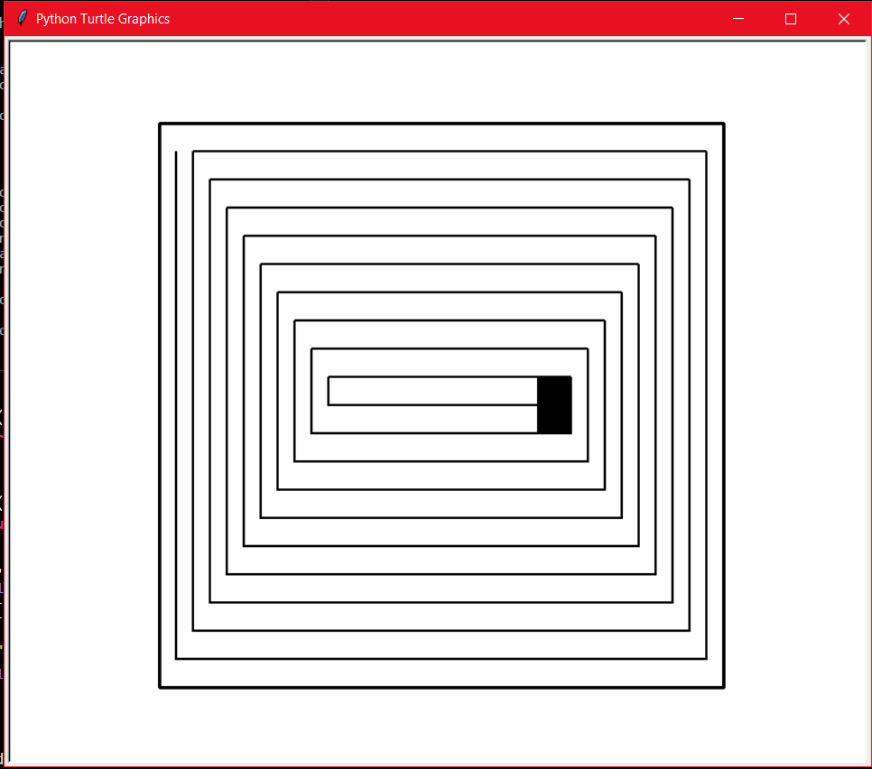

# WheeledMobile

A) 

B) 

C) 

If done with swedish wheels the corners are no longer an issue for the robot, ie while turning the corners of 
the bot will no longer go out of bounds. This is in part due to not needing to turn at all with swedish wheels 
as the bot can move in any direction on the 2D plane and fit perfectly into the corners. This can be better seen if the line 
drawn is increased to the size of the robot itself. As for issues to expect, the skidsteer will have a harder time 
staying with in the bounds of the area without needing to move back and forth repeatedly to complete 5 - 50 point turns. 
The swedish on the other hand will have much more mechanical complexity and be limited on the terran it can cross. 
Say this was a lawn mowing algorithm, while the omni directionality of the swedish wheels would make covering shapes 
easier it would likely face many issues being on any sort of non flat or off road terran. Skidsteer on the other hand would 
laugh maniacally and continue on its way.